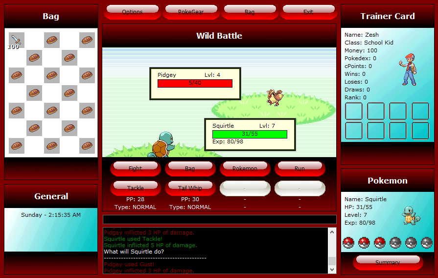
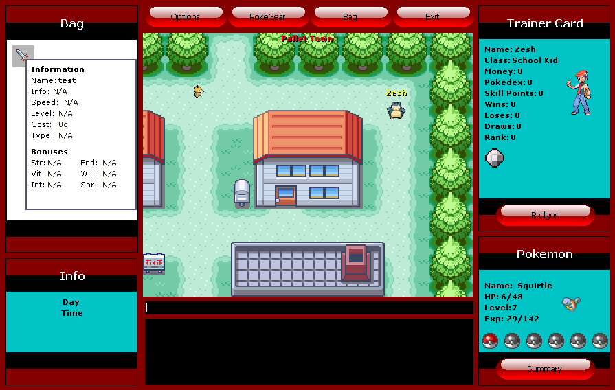
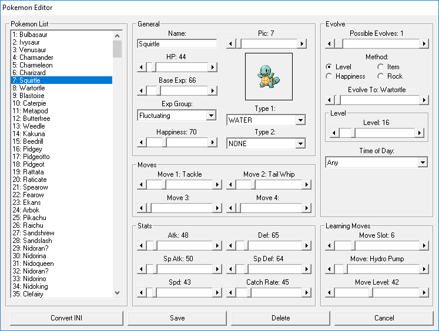

### Freelance Programmer
#### Skills: GODOT / NETWORKING / C++ / VB6
I've been programming for a few years in a mix of VB6 and C++.

I have strong experience with networking, turn-based battle systems and tile-based games.

I can design and implement various systems and write technical design documents.

#### Work Experience
Freelance Programmer / June 2022-February 2023

#### Personal Projects
- An implementation of Pokemon FireRed's battle system in Godot:

- A multiplayer Pokemon game in a custom engine:

